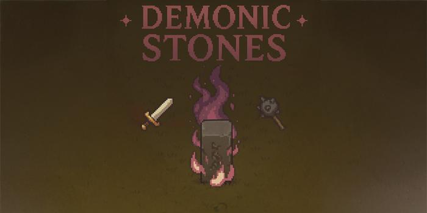

# Demonic Stones

## 🕹️ About

**Demonic Stones** is a 2D top-down pixel art rogue-like, inspired by classic MMORPG vibes — especially as an homage to the legendary *Metin2*.  
The game aims to capture that nostalgic feeling of battling through enemy hordes, breaking cursed stones, and uncovering secrets in a mystical world.

> This is a passion project currently in its early development phase.

## ⚔️ Vision

At the heart of the game are the **Demonic Stones** — mysterious, glowing rocks that corrupt the land and spawn waves of enemies until destroyed.  
The goal is to create a gameplay loop reminiscent of old-school MMORPG grinding, but wrapped in rogue-like mechanics and procedural elements.

- Pixel art style with a modern rogue-lite twist  
- Enemies spawn from stone obelisks that must be destroyed  
- Fast-paced action with random drops and item collection  
- Permadeath + respawn system with progress-saving anchors

## 🔧 Gameplay Mechanics (WIP)

- Top-down 2D combat and movement
- Procedural enemy spawning through demonic stone mechanics
- Respawn system with "return to last death" or "return home" functionality
- More to come (skills, loot, dungeon systems, etc.)

## 📦 Tech Stack

- [Godot Engine 4.4+](https://godotengine.org/)
- GDScript
- A* Navigation, Behavior Trees, Signal-based systems, etc.

## 🚧 Current Status

- Player movement & combat system: ✅  
- Demonic stones and enemy spawns: ✅  
- Respawn logic (including “death location” saving): ✅  
- Early AI with Behavior Trees: ⏳  
- UI and death screen logic: ⏳  
- Procedural content & real gameplay loop: ❌

## 👤 Author

Created by @donfluxxo

## 📜 License

This project is licensed under the MIT License. See the [LICENSE](./LICENSE) file for more info.
