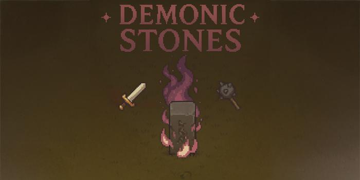

# ⚔️ Demonic Stones 🌀

## 🕹️ About

**Demonic Stones** is a 2D top-down pixel art rogue-like, inspired by classic MMORPG vibes — especially as an homage to the legendary *Metin2*.  
The game aims to capture that nostalgic feeling of battling through enemy hordes, breaking cursed stones, and uncovering secrets in a mystical world.

> This is a passion project currently in its very early development phase.

## ⚔️ Vision

At the heart of the game are the **Demonic Stones** — mysterious, glowing rocks that corrupt the land and spawn waves of enemies until destroyed.  
The goal is to create a gameplay loop reminiscent of old-school MMORPG grinding, but wrapped in rogue-like mechanics and procedural elements.

- Pixel art style with a modern rogue-lite twist  
- Enemies spawn from stone obelisks that must be destroyed  
- Fast-paced action with random drops and item collection  
- Permadeath + respawn system with progress-saving anchors

## 🔧 Gameplay Mechanics (WIP)

- Top-down 2D combat and movement
- Procedural enemy spawning through demonic stone mechanics
- Respawn system with "return to last death" or "return home" functionality
- More to come (skills, loot, dungeon systems, etc.):

## 📦 Tech Stack

- [Godot Engine 4.4+](https://godotengine.org/)
- GDScript
- [LimboAI Plugin](https://godotengine.org/asset-library/asset/3787)
- A* Navigation, Behavior Trees, Signal-based systems, etc.

## 🚧 Current Status

- Basic player movement & combat system: ✅  
- Demonic stones and enemy spawns: ✅
- Health and death systems: ✅
- Early AI with Behavior Trees: ✅  
- UI and death screen logic: ✅
- Respawn logic (including “death location” saving): ✅
- Procedural content & real gameplay loop: ❌

## 🧭 (Possible) Planned Features

- Multiple playable characters with unique stats
- Swappable weapons (e.g., swords, longswords, axes, bows, spears maces, etc)
- Enemy variety with different difficulty levels
- Tiered stones (color-coded) that spawn different enemies
- Buff items and consumables
- Inventory system (maybe)
- Equipment and armor system
- Stat or leveling system (possibly upgrade points)
- Spell casting system
- Summonable companion helpers (e.g. mini pets or spirits)
- Possibly meta progression elements like unlocks or upgrades

## 📷 Screenshots

(Coming soon)

## 👤 Author

Created by @donfluxxo

This is an early-stage passion project. I'm open to feedback, suggestions, or even collaboration!  
If you're interested in contributing or discussing ideas, feel free to reach out via GitHub Issues or Pull Requests.

## 📜 License

This project is licensed under the MIT License. See the [LICENSE](./LICENSE) file for more info. 

All third-party assets used in this project are either created by me or used under licenses that allow free and commercial use. If attribution is required, it is listed in the credits.

